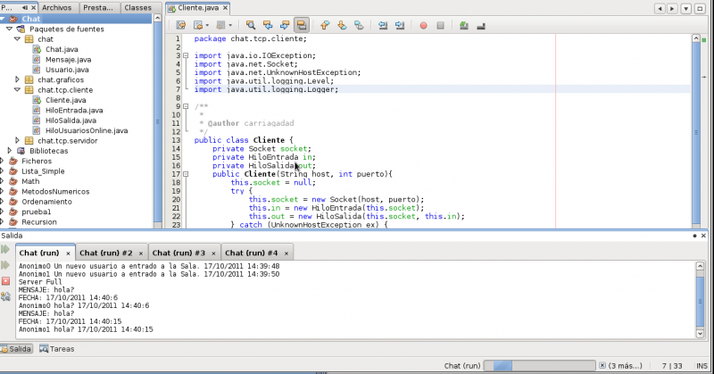

# Chat en JAVA



El server tiene un tamaño máximo de clientes, en el vídeo estaba seteado para 2 clientes...

Objeto serializado **Mensaje**
MENSAJE:
FECHA:

Objeto serializado **Usuario**
Anonimo0 (Nick)
FechaInicial

Historial de mensajes por lado del cliente(Tmp)

https://www.youtube.com/watch?v=H1CKDsu1qzc&feature=youtu.be

**ChatNoApplet.java**
```java
package chatnoapplet;

import chatnoapplet.tcp.servidor.Servidor;
import java.net.InetAddress;
import java.net.UnknownHostException;

/**
 *
 * @author carriagadad
 */
public class ChatNoApplet {

    /**
     * @param args the command line arguments
     */
    public static void main(String[] args) {
        Servidor s;
        if(args.length == 1){
                s = new Servidor(Integer.parseInt(args[0]), 2);
            }
            else
                s = new Servidor(8030, 2);
        InetAddress host;
        try {
            host = InetAddress.getLocalHost();
        } catch (UnknownHostException ex) {
            System.out.println("Error al conectar al Servidor");
        }
            
    }
}
```

**Conex.java**
```java
package chatnoapplet.tcp.servidor;

import chatnoapplet.Mensaje;
import chatnoapplet.Usuario;
import java.io.IOException;
import java.net.ServerSocket;
import java.net.Socket;
import java.util.logging.Level;
import java.util.logging.Logger;

/**
 *
 * @author carriagadad
 */
public class Conex implements Observador {
    //El socket del servidor.

    private ServerSocket socketServidor;
    private HiloCliente[] clientes;
    private ControlMensaje control;
    private Mensaje mensajeCentral;
    private Usuario[] usuarios;
    private int puerto;
    private int idCliente;

    Conex(int puerto, int maxClientes) {
        this.socketServidor = null;
        this.control = new ControlMensaje();
        this.puerto = puerto;
        this.clientes = new HiloCliente[maxClientes];
        this.usuarios = new Usuario[maxClientes];
        this.mensajeCentral = null;
        this.idCliente = 0;
        //Inicia el servicio
        this.inixServicio();
    }

    private void inixServicio() {
        try {
            this.socketServidor = new ServerSocket(this.puerto);
        } catch (IOException ex) {
            Logger.getLogger(Conex.class.getName()).log(Level.SEVERE, null, ex);
        }
        //Suscibrimos a esta clase(Conex) para que escuche a los Clientes.
        this.control.suscribir(this);
    }

    public void clienteNuevo() {
        try {
            boolean disponible = false;
            Socket socket = this.socketServidor.accept();
            for (int i = 0; i < this.clientes.length; i++) {
                //Reviso si queda una entrada disponible
                if ((this.clientes[i] == null) || (!this.clientes[i].isAlive())) {
                    //Crea un objeto usuario
                    this.usuarios[i] = new Usuario("Anonimo"+(this.idCliente++));
                    //Le pasamos el control para enviar mensajes al cliente nuevo, para que envie mensajes.
                    this.clientes[i] = new HiloCliente(socket, this.usuarios[i], this.control);
                    
                    //Suscribo al nuevo cliente para que reciba mensajes del resto.
                    this.control.suscribir(this.clientes[i]);
                    
                    //Luego que se ha enviado el primer mensaje desde la central esa fecha es la ini del usuario
                    this.mensajeCentral = new Mensaje();
                    this.mensajeCentral.setMensaje(this.usuarios[i].getNick()+" ha entrado a la Sala");
                    //Utilizo esa fecha para setear la fecha de inicio del usuario
                    this.usuarios[i].setFechaIni(this.mensajeCentral.getFecha());
                    
                    this.control.enviarMensaje(new Usuario("CNX"), this.mensajeCentral);
                    
                    this.clientes[i].setPriority(Thread.MAX_PRIORITY);
                    this.clientes[i].start();
                    
                    disponible = true;
                    break;
                }
            }
            if (!disponible) {
                System.out.println("Server Full");
            }
        } catch (IOException ex) {
            Logger.getLogger(Conex.class.getName()).log(Level.SEVERE, null, ex);

        }
    }

    @Override
    public void broadcast(Usuario usuario, Mensaje mensaje) {
        //Observador para conex y servidor este al tanto de lo que hablan los clientes.
        if(mensaje != null)
            System.out.println("["+mensaje.getFecha()+"] "+usuario.getNick()+": "+mensaje.getMensaje());
        if (usuario == null || mensaje == null) {
            throw new UnsupportedOperationException("Not supported yet.");
        }
    }
}
```

**Cliente.java**
```java
package chatnoapplet.tcp.cliente;

import java.io.File;
import java.io.IOException;
import java.net.InetAddress;
import java.net.Socket;
import java.net.UnknownHostException;
import java.util.logging.Level;
import java.util.logging.Logger;
/**
 *
 * @author carriagadad
 */
public class Cliente extends chatnoapplet.graficos.Chat {

    private Socket socket;
    private HiloEntrada in;
    private HiloSalida out;
    
    private File temporal;
    private HiloGuardaHistorial historial;
    
    public Cliente(String host, int puerto){
        //Socket del Cliente
        this.socket = null;
        //Hilos de Entrada y Salida
        this.in = null;
        this.out = null;
        this.historial = null;
        try {
            //Hago visible la interfaz grafica
            super.setVisible(rootPaneCheckingEnabled);
            //Socket del cliente
            this.socket = new Socket(host, puerto);
            //Para guardar el historial
            this.temporal = File.createTempFile("Historial", ".dat");
            this.historial = new HiloGuardaHistorial(temporal);
            //Hilo de Salida con la clase chat para los metodos jtext y jtextn y el boton y jtext para controlar la entrada desde el form
            this.out = new HiloSalida(this.socket, this, this.jTextArea1, this.jButton1, this.historial);
            //Hilo de Salida con la clase chat para los metodos jtext y jtextn
            this.in = new HiloEntrada(this.socket, this, this.historial);
            
            this.inix();
        
        } catch (UnknownHostException ex) {
            System.out.println("Error al conectar al Servidor");
        } catch (IOException ex) {
            this.jTextN("CNX: ");
            this.jText("Servidor no activo");
        }
    }
    private void inix(){
            this.in.setPriority(Thread.MAX_PRIORITY);
            //Thread fue reemplazado
            //this.out.setPriority(Thread.MAX_PRIORITY);
            
            this.in.start();
            //Thread fue reemplazado
            //this.out.start();
    }
    public static void main(String[] args){
        try {
            InetAddress host = InetAddress.getLocalHost();
            Cliente c = new Cliente(host.getHostName(), 8030);
        } catch (UnknownHostException ex) {
            Logger.getLogger(Cliente.class.getName()).log(Level.SEVERE, null, ex);
        }
        
    }
}
```

**Descargar todos los fuentes:**

pendiente...


