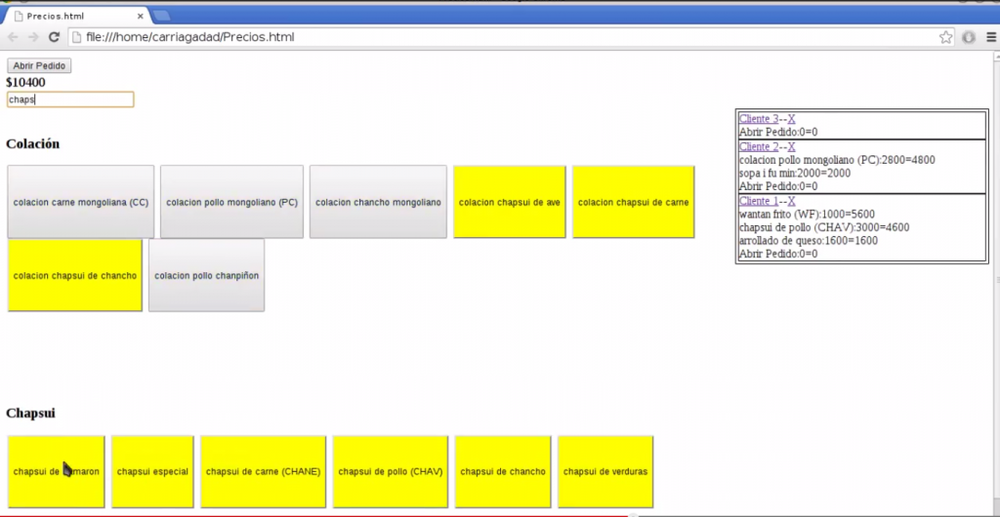

Herramienta útil para cobro de productos que puedes utilizar en tu almacén, agilizando el proceso y evitando posibles errores de cobro. Esto sólo requiere de un navegador con javascript habilitado. Una versión muy básica, pero funcional y útil para negocios.



Los productos los registras en el mismo archivo, de esta forma:

```html
<div id="colacion">
  <h3>Colación</h3>
  <input
    style="width:auto;height:100px;"
    type="button"
    value="colacion carne mongoliana (CC)"
    onclick="suma_pedido(this.value, 2800)"
  />
  <input
    style="width:auto;height:100px;"
    type="button"
    value="colacion pollo mongoliano (PC)"
    onclick="suma_pedido(this.value, 2800)"
  />
  <input
    style="width:auto;height:100px;"
    type="button"
    value="colacion chancho mongoliano"
    onclick="suma_pedido(this.value, 2800)"
  />
  <input
    style="width:auto;height:100px;"
    type="button"
    value="colacion chapsui de ave"
    onclick="suma_pedido(this.value, 2600)"
  />
  <input
    style="width:auto;height:100px;"
    type="button"
    value="colacion chapsui de carne"
    onclick="suma_pedido(this.value, 2600)"
  />
  <input
    style="width:auto;height:100px;"
    type="button"
    value="colacion chapsui de chancho"
    onclick="suma_pedido(this.value, 2600)"
  />
  <input
    style="width:auto;height:100px;"
    type="button"
    value="colacion pollo chanpiñon"
    onclick="suma_pedido(this.value, 3200)"
  />
</div>
<br />
```

**colacion** es un grupo de productos, donde cada producto:

```html
<input
  style="width:auto;height:100px;"
  type="button"
  value="colacion pollo chanpiñon"
  onclick="suma_pedido(this.value, 3200)"
/>
```

contiene una descripción (en minúscula por defecto) **colacion pollo chanpiñon** y un valor 3200

https://www.youtube.com/watch?v=ZpAm2uVOonk