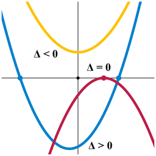
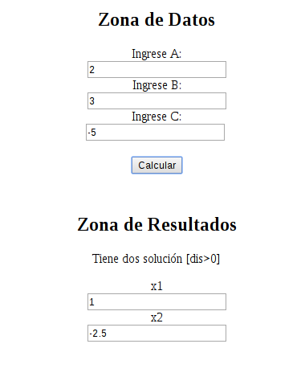

Me gustaría compartir este pequeño código javascript. Este fragmento de código se puede ejecutar en cualquier navegador con javascript habilitado.

Recordar que las soluciones x1,x2 son intersecciones entre el eje x (y = 0) y la ecuación cuadrática:

Si alguien esta interesado en usarlo, lo que tiene que hacer es copiar el codigo, luego pegarlo en editor de texto que puede ser blog de notas por ej., luego lo guardan con el nombre que quieran punto html (ALGUNNOMBRE.html) y **SUPER IMPORTANTE**, en tipo deben colocar **Todos los archivos**, y listo.

Para probar esta calculadora solo deben dar doble clic al archivo y este se abrirá en el navegador que tengan instalado, y se verá algo similar a la foto.

