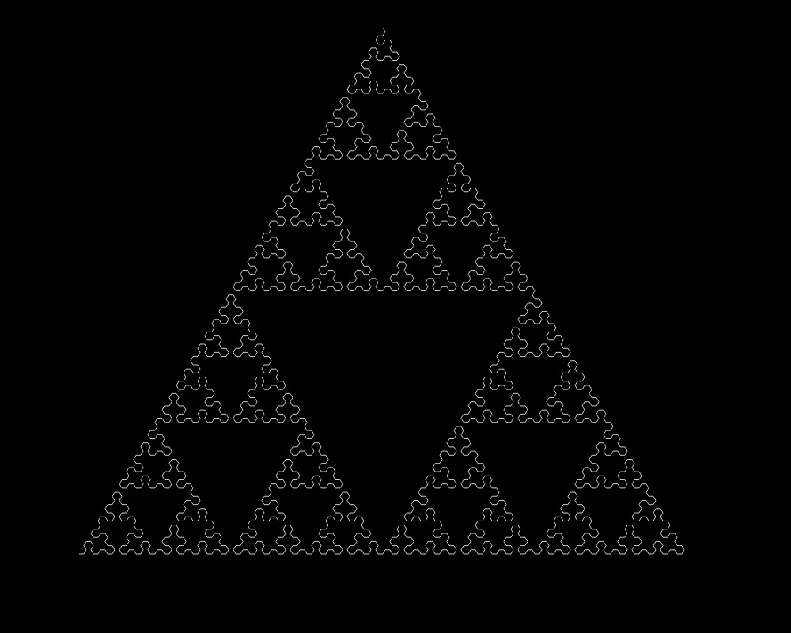

The Sierpinski triangle is a fractal formed by recursively subdividing an equilateral triangle into four smaller congruent triangles, removing the central one, and repeating the process infinitely. This creates a self-similar pattern with zero area, Hausdorff dimension ∼1.585, and intricate geometric complexity. Named after **Wacław Sierpiński**.



**Salida:**
```
triangle.html:76 B-A-B
triangle.html:76 A+B+A-B-A-B-A+B+A
triangle.html:76 B-A-B+A+B+A+B-A-B-A+B+A-B-A-B-A+B+A-B-A-B+A+B+A+B-A-B
triangle.html:76 A+B+A-B-A-B-A+B+A+B-A-B+A+B+A+B-A-B+A+B+A-B-A-B-A+B+A-B-A-B+A+B+A+B-A-B-A+B+A-B-A-B-A+B+A-B-A-B+A+B+A+B-A-B-A+B+A-B-A-B-A+B+A+B-A-B+A+B+A+B-A-B+A+B+A-B-A-B-A+B+A
triangle.html:76 B-A-B+A+B+A+B-A-B-A+B+A-B-A-B-A+B+A-B-A-B+A+B+A+B-A-B+A+B+A-B-A-B-A+B+A+B-A-B+A+B+A+B-A-B+A+B+A-B-A-B-A+B+A+B-A-B+A+B+A+B-A-B-A+B+A-B-A-B-A+B+A-B-A-B+A+B+A+B-A-B-A+B+A-B-A-B-A+B+A+B-A-B+A+B+A+B-A-B+A+B+A-B-A-B-A+B+A-B-A-B+A+B+A+B-A-B-A+B+A-B-A-B-A+B+A-B-A-B+A+B+A+B-A-B-A+B+A-B-A-B-A+B+A+B-A-B+A+B+A+B-A-B+A+B+A-B-A-B-A+B+A-B-A-B+A+B+A+B-A-B-A+B+A-B-A-B-A+B+A-B-A-B+A+B+A+B-A-B+A+B+A-B-A-B-A+B+A+B-A-B+A+B+A+B-A-B+A+B+A-B-A-B-A+B+A+B-A-B+A+B+A+B-A-B-A+B+A-B-A-B-A+B+A-B-A-B+A+B+A+B-A-B
triangle.html:76 A+B+A-B-A-B-A+B+A+B-A-B+A+B+A+B-A-B+A+B+A-B-A-B-A+B+A-B-A-B+A+B+A+B-A-B-A+B+A-B-A-B-A+B+A-B-A-B+A+B+A+B-A-B-A+B+A-B-A-B-A+B+A+B-A-B+A+B+A+B-A-B+A+B+A-B-A-B-A+B+A+B-A-B+A+B+A+B-A-B-A+B+A-B-A-B-A+B+A-B-A-B+A+B+A+B-A-B+A+B+A-B-A-B-A+B+A+B-A-B+A+B+A+B-A-B+A+B+A-B-A-B-A+B+A+B-A-B+A+B+A+B-A-B-A+B+A-B-A-B-A+B+A-B-A-B+A+B+A+B-A-B+A+B+A-B-A-B-A+B+A+B-A-B+A+B+A+B-A-B+A+B+A-B-A-B-A+B+A-B-A-B+A+B+A+B-A-B-A+B+A-B-A-B-A+B+A-B-A-B+A+B+A+B-A-B-A+B+A-B-A-B-A+B+A+B-A-B+A+B+A+B-A-B+A+B+A-B-A-B-A+B+A-B-A-B+A+B+A+B-A-B-A+B+A-B-A-B-A+B+A-B-A-B+A+B+A+B-A-B+A+B+A-B-A-B-A+B+A+B-A-B+A+B+A+B-A-B+A+B+A-B-A-B-A+B+A+B-A-B+A+B+A+B-A-B-A+B+A-B-A-B-A+B+A-B-A-B+A+B+A+B-A-B-A+B+A-B-A-B-A+B+A+B-A-B+A+B+A+B-A-B+A+B+A-B-A-B-A+B+A-B-A-B+A+B+A+B-A-B-A+B+A-B-A-B-A+B+A-B-A-B+A+B+A+B-A-B-A+B+A-B-A-B-A+B+A+B-A-B+A+B+A+B-A-B+A+B+A-B-A-B-A+B+A-B-A-B+A+B+A+B-A-B-A+B+A-B-A-B-A+B+A-B-A-B+A+B+A+B-A-B+A+B+A-B-A-B-A+B+A+B-A-B+A+B+A+B-A-B+A+B+A-B-A-B-A+B+A+B-A-B+A+B+A+B-A-B-A+B+A-B-A-B-A+B+A-B-A-B+A+B+A+B-A-B-A+B+A-B-A-B-A+B+A+B-A-B+A+B+A+B-A-B+A+B+A-B-A-B-A+B+A-B-A-B+A+B+A+B-A-B-A+B+A-B-A-B-A+B+A-B-A-B+A+B+A+B-A-B-A+B+A-B-A-B-A+B+A+B-A-B+A+B+A+B-A-B+A+B+A-B-A-B-A+B+A+B-A-B+A+B+A+B-A-B-A+B+A-B-A-B-A+B+A-B-A-B+A+B+A+B-A-B+A+B+A-B-A-B-A+B+A+B-A-B+A+B+A+B-A-B+A+B+A-B-A-B-A+B+A+B-A-B+A+B+A+B-A-B-A+B+A-B-A-B-A+B+A-B-A-B+A+B+A+B-A-B+A+B+A-B-A-B-A+B+A+B-A-B+A+B+A+B-A-B+A+B+A-B-A-B-A+B+A-B-A-B+A+B+A+B-A-B-A+B+A-B-A-B-A+B+A-B-A-B+A+B+A+B-A-B-A+B+A-B-A-B-A+B+A+B-A-B+A+B+A+B-A-B+A+B+A-B-A-B-A+B+A
triangle.html:76 B-A-B+A+B+A+B-A-B-A+B+A-B-A-B-A+B+A-B-A-B+A+B+A+B-A-B+A+B+A-B-A-B-A+B+A+B-A-B+A+B+A+B-A-B+A+B+A-B-A-B-A+B+A+B-A-B+A+B+A+B-A-B-A+B+A-B-A-B-A+B+A-B-A-B+A+B+A+B-A-B-A+B+A-B-A-B-A+B+A+B-A-B+A+B+A+B-A-B+A+B+A-B-A-B-A+B+A-B-A-B+A+B+A+B-A-B-A+B+A-B-A-B-A+B+A-B-A-B+A+B+A+B-A-B-A+B+A-B-A-B-A+B+A+B-A-B+A+B+A+B-A-B+A+B+A-B-A-B-A+B+A-B-A-B+A+B+A+B-A-B-A+B+A-B-A-B-A+B+A-B-A-B+A+B+A+B-A-B+A+B+A-B-A-B-A+B+A+B-A-B+A+B+A+B-A-B+A+B+A-B-A-B-A+B+A+B-A-B+A+B+A+B-A-B-A+B+A-B-A-B-A+B+A-B-A-B+A+B+A+B-A-B+A+B+A-B-A-B-A+B+A+B-A-B+A+B+A+B-A-B+A+B+A-B-A-B-A+B+A-B-A-B+A+B+A+B-A-B-A+B+A-B-A-B-A+B+A-B-A-B+A+B+A+B-A-B-A+B+A-B-A-B-A+B+A+B-A-B+A+B+A+B-A-B+A+B+A-B-A-B-A+B+A+B-A-B+A+B+A+B-A-B-A+B+A-B-A-B-A+B+A-B-A-B+A+B+A+B-A-B+A+B+A-B-A-B-A+B+A+B-A-B+A+B+A+B-A-B+A+B+A-B-A-B-A+B+A+B-A-B+A+B+A+B-A-B-A+B+A-B-A-B-A+B+A-B-A-B+A+B+A+B-A-B+A+B+A-B-A-B-A+B+A+B-A-B+A+B+A+B-A-B+A+B+A-B-A-B-A+B+A-B-A-B+A+B+A+B-A-B-A+B+A-B-A-B-A+B+A-B-A-B+A+B+A+B-A-B-A+B+A-B-A-B-A+B+A+B-A-B+A+B+A+B-A-B+A+B+A-B-A-B-A+B+A+B-A-B+A+B+A+B-A-B-A+B+A-B-A-B-A+B+A-B-A-B+A+B+A+B-A-B+A+B+A-B-A-B-A+B+A+B-A-B+A+B+A+B-A-B+A+B+A-B-A-B-A+B+A+B-A-B+A+B+A+B-A-B-A+B+A-B-A-B-A+B+A-B-A-B+A+B+A+B-A-B-A+B+A-B-A-B-A+B+A+B-A-B+A+B+A+B-A-B+A+B+A-B-A-B-A+B+A-B-A-B+A+B+A+B-A-B-A+B+A-B-A-B-A+B+A-B-A-B+A+B+A+B-A-B-A+B+A-B-A-B-A+B+A+B-A-B+A+B+A+B-A-B+A+B+A-B-A-B-A+B+A-B-A-B+A+B+A+B-A-B-A+B+A-B-A-B-A+B+A-B-A-B+A+B+A+B-A-B+A+B+A-B-A-B-A+B+A+B-A-B+A+B+A+B-A-B+A+B+A-B-A-B-A+B+A+B-A-B+A+B+A+B-A-B-A+B+A-B-A-B-A+B+A-B-A-B+A+B+A+B-A-B-A+B+A-B-A-B-A+B+A+B-A-B+A+B+A+B-A-B+A+B+A-B-A-B-A+B+A-B-A-B+A+B+A+B-A-B-A+B+A-B-A-B-A+B+A-B-A-B+A+B+A+B-A-B-A+B+A-B-A-B-A+B+A+B-A-B+A+B+A+B-A-B+A+B+A-B-A-B-A+B+A+B-A-B+A+B+A+B-A-B-A+B+A-B-A-B-A+B+A-B-A-B+A+B+A+B-A-B+A+B+A-B-A-B-A+B+A+B-A-B+A+B+A+B-A-B+A+B+A-B-A-B-A+B+A+B-A-B+A+B+A+B-A-B-A+B+A-B-A-B-A+B+A-B-A-B+A+B+A+B-A-B+A+B+A-B-A-B-A+B+A+B-A-B+A+B+A+B-A-B+A+B+A-B-A-B-A+B+A-B-A-B+A+B+A+B-A-B-A+B+A-B-A-B-A+B+A-B-A-B+A+B+A+B-A-B-A+B+A-B-A-B-A+B+A+B-A-B+A+B+A+B-A-B+A+B+A-B-A-B-A+B+A-B-A-B+A+B+A+B-A-B-A+B+A-B-A-B-A+B+A-B-A-B+A+B+A+B-A-B+A+B+A-B-A-B-A+B+A+B-A-B+A+B+A+B-A-B+A+B+A-B-A-B-A+B+A+B-A-B+A+B+A+B-A-B-A+B+A-B-A-B-A+B+A-B-A-B+A+B+A+B-A-B-A+B+A-B-A-B-A+B+A+B-A-B+A+B+A+B-A-B+A+B+A-B-A-B-A+B+A-B-A-B+A+B+A+B-A-B-A+B+A-B-A-B-A+B+A-B-A-B+A+B+A+B-A-B-A+B+A-B-A-B-A+B+A+B-A-B+A+B+A+B-A-B+A+B+A-B-A-B-A+B+A-B-A-B+A+B+A+B-A-B-A+B+A-B-A-B-A+B+A-B-A-B+A+B+A+B-A-B+A+B+A-B-A-B-A+B+A+B-A-B+A+B+A+B-A-B+A+B+A-B-A-B-A+B+A+B-A-B+A+B+A+B-A-B-A+B+A-B-A-B-A+B+A-B-A-B+A+B+A+B-A-B-A+B+A-B-A-B-A+B+A+B-A-B+A+B+A+B-A-B+A+B+A-B-A-B-A+B+A-B-A-B+A+B+A+B-A-B-A+B+A-B-A-B-A+B+A-B-A-B+A+B+A+B-A-B-A+B+A-B-A-B-A+B+A+B-A-B+A+B+A+B-A-B+A+B+A-B-A-B-A+B+A+B-A-B+A+B+A+B-A-B-A+B+A-B-A-B-A+B+A-B-A-B+A+B+A+B-A-B+A+B+A-B-A-B-A+B+A+B-A-B+A+B+A+B-A-B+A+B+A-B-A-B-A+B+A+B-A-B+A+B+A+B-A-B-A+B+A-B-A-B-A+B+A-B-A-B+A+B+A+B-A-B+A+B+A-B-A-B-A+B+A+B-A-B+A+B+A+B-A-B+A+B+A-B-A-B-A+B+A-B-A-B+A+B+A+B-A-B-A+B+A-B-A-B-A+B+A-B-A-B+A+B+A+B-A-B-A+B+A-B-A-B-A+B+A+B-A-B+A+B+A+B-A-B+A+B+A-B-A-B-A+B+A-B-A-B+A+B+A+B-A-B-A+B+A-B-A-B-A+B+A-B-A-B+A+B+A+B-A-B+A+B+A-B-A-B-A+B+A+B-A-B+A+B+A+B-A-B+A+B+A-B-A-B-A+B+A+B-A-B+A+B+A+B-A-B-A+B+A-B-A-B-A+B+A-B-A-B+A+B+A+B-A-B-A+B+A-B-A-B-A+B+A+B-A-B+A+B+A+B-A-B+A+B+A-B-A-B-A+B+A-B-A-B+A+B+A+B-A-B-A+B+A-B-A-B-A+B+A-B-A-B+A+B+A+B-A-B-A+B+A-B-A-B-A+B+A+B-A-B+A+B+A+B-A-B+A+B+A-B-A-B-A+B+A-B-A-B+A+B+A+B-A-B-A+B+A-B-A-B-A+B+A-B-A-B+A+B+A+B-A-B+A+B+A-B-A-B-A+B+A+B-A-B+A+B+A+B-A-B+A+B+A-B-A-B-A+B+A+B-A-B+A+B+A+B-A-B-A+B+A-B-A-B-A+B+A-B-A-B+A+B+A+B-A-B+A+B+A-B-A-B-A+B+A+B-A-B+A+B+A+B-A-B+A+B+A-B-A-B-A+B+A-B-A-B+A+B+A+B-A-B-A+B+A-B-A-B-A+B+A-B-A-B+A+B+A+B-A-B-A+B+A-B-A-B-A+B+A+B-A-B+A+B+A+B-A-B+A+B+A-B-A-B-A+B+A+B-A-B+A+B+A+B-A-B-A+B+A-B-A-B-A+B+A-B-A-B+A+B+A+B-A-B+A+B+A-B-A-B-A+B+A+B-A-B+A+B+A+B-A-B+A+B+A-B-A-B-A+B+A+B-A-B+A+B+A+B-A-B-A+B+A-B-A-B-A+B+A-B-A-B+A+B+A+B-A-B+A+B+A-B-A-B-A+B+A+B-A-B+A+B+A+B-A-B+A+B+A-B-A-B-A+B+A-B-A-B+A+B+A+B-A-B-A+B+A-B-A-B-A+B+A-B-A-B+A+B+A+B-A-B-A+B+A-B-A-B-A+B+A+B-A-B+A+B+A+B-A-B+A+B+A-B-A-B-A+B+A+B-A-B+A+B+A+B-A-B-A+B+A-B-A-B-A+B+A-B-A-B+A+B+A+B-A-B+A+B+A-B-A-B-A+B+A+B-A-B+A+B+A+B-A-B+A+B+A-B-A-B-A+B+A+B-A-B+A+B+A+B-A-B-A+B+A-B-A-B-A+B+A-B-A-B+A+B+A+B-A-B-A+B+A-B-A-B-A+B+A+B-A-B+A+B+A+B-A-B+A+B+A-B-A-B-A+B+A-B-A-B+A+B+A+B-A-B-A+B+A-B-A-B-A+B+A-B-A-B+A+B+A+B-A-B-A+B+A-B-A-B-A+B+A+B-A-B+A+B+A+B-A-B+A+B+A-B-A-B-A+B+A-B-A-B+A+B+A+B-A-B-A+B+A-B-A-B-A+B+A-B-A-B+A+B+A+B-A-B+A+B+A-B-A-B-A+B+A+B-A-B+A+B+A+B-A-B+A+B+A-B-A-B-A+B+A+B-A-B+A+B+A+B-A-B-A+B+A-B-A-B-A+B+A-B-A-B+A+B+A+B-A-B
```