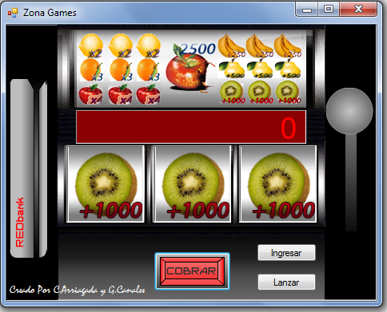

# Slot Machine



https://www.youtube.com/watch?v=y-ej4NihREs

**DESC: Pequeño jueguito implementado con G. Canales**

```vb Public Class Aleatoria
    Dim n As Integer
    Dim esp1 As Integer
    Dim esp2 As Integer
    Dim esp3 As Integer
    Dim eleg As Boolean
    Dim nr As Integer
    Dim ne1 As Integer
    Dim ne2 As Integer
    Dim ne3 As Integer
    Dim nf1 As Integer
    Dim nf2 As Integer
    Dim nf3 As Integer
    Dim bloq As Boolean
    Dim mov1 As Boolean
    Dim mov2 As Boolean
    Dim mov3 As Boolean
    Dim r As New Random()
    Dim maxI As Integer
    Public Sub New()
        inicializa()
    End Sub
    Sub inicializa()
        n = 200
        maxI = 13
        esp1 = r.Next(1, maxI)
        esp2 = r.Next(1, maxI)
        esp3 = r.Next(1, maxI)
        mov1 = True
        mov2 = True
        mov3 = True
        bloq = False
        eleg = False
    End Sub

    Sub randI()
        If (Not eleg) Then
            nr = r.Next(1, 34222)
            ne1 = r.Next(1, (CInt(r.NextDouble) * 22231) + 11)
            ne2 = r.Next(1, (CInt(r.NextDouble) * 22231) + 11)
            ne3 = r.Next(1, (CInt(r.NextDouble) * 22231) + 11)
            nf1 = nr * ne1 Mod maxI
            nf2 = nr * ne2 Mod maxI
            nf3 = nr * ne3 Mod maxI
            If (nf1 Mod 2 = 1) Then
                nf1 += 1
            End If
            If (nf2 Mod 2 = 1) Then
                nf2 += 1
            End If
            If (nf3 Mod 2 = 1) Then
                nf3 += 1
            End If
        End If

        Form1.Timer1.Interval = n

        If (mov1) Then
            Form1.pB1.Image = Form1.iList.Images(esp1 Mod maxI)
        End If
        If (mov2) Then
            Form1.pB2.Image = Form1.iList.Images(esp2 Mod maxI)
        End If
        If (mov3) Then
            Form1.pB3.Image = Form1.iList.Images(esp3 Mod maxI)
        End If

        If (n >= 201) Then

            If (nf1 = (esp1 Mod maxI)) Then
                mov1 = False
            End If
            If (nf2 = (esp2 Mod maxI)) Then
                mov2 = False
            End If

            If (nf3 = (esp3 Mod maxI)) Then
                mov3 = False
            End If

            If ((Not mov1) And (Not mov2) And (Not mov3)) Then
                inicializa()
                Form1.Timer1.Enabled = False
                Form1.btnLanzar.Enabled = True
                Revisar(nf1, nf2, nf3)
            End If

        ElseIf (n <= 100) Then
            bloq = True
        End If
        If (bloq) And (esp1 >= 50) Then
            eleg = True
            n += 15
        ElseIf (Not bloq) Then
            n -= 15
        End If

        esp1 += 1
        esp2 += 1
        esp3 += 1

    End Sub

End Class
```

Lo pueden descargar en el siguiente enlace:

https://www.mediafire.com/file/sdtmy4qab3aa176/Trabajo%20Tragamonedas.rar